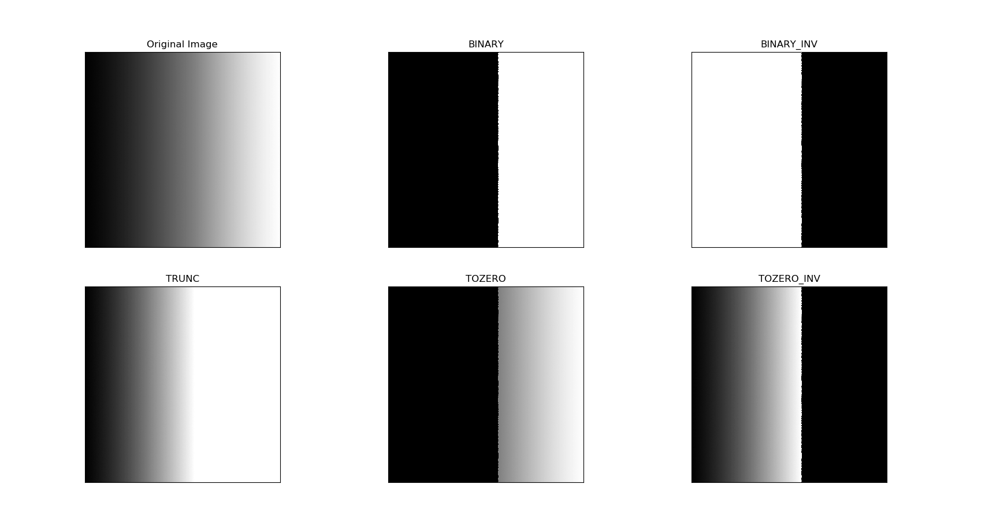
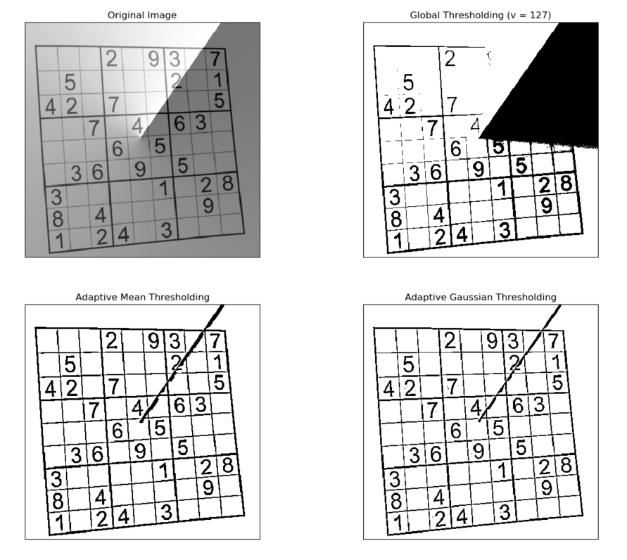
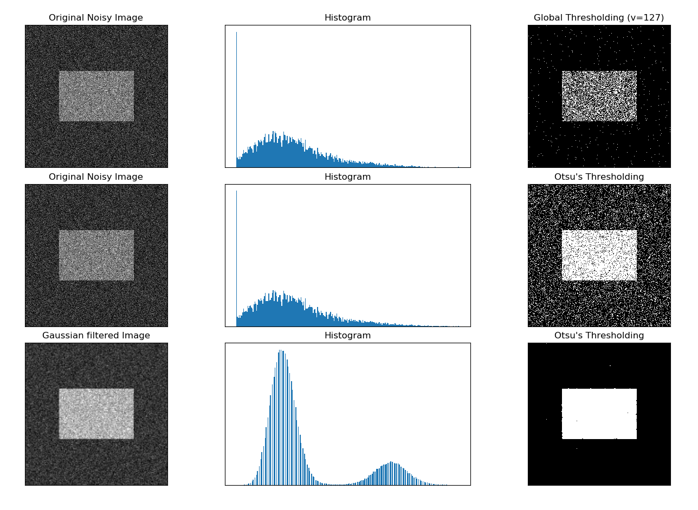

## 3.图像阈值


*目标*
* 本节你将学到简单阈值，自适应阈值，Otsu’s 二值化等
* 将要学习的函数有 cv2.threshold，cv2.adaptiveThreshold 等。
---

### 3.1 简单阈值

与名字一样，这种方法非常简单。但像素值高于阈值时，我们给这个像素 赋予一个新值（可能是白色），否则我们给它赋予另外一种颜色（也许是黑色）。 这个函数就是 cv2.threshhold()。这个函数的第一个参数就是原图像，原图 像应该是灰度图。第二个参数就是用来对像素值进行分类的阈值。第三个参数就是当像素值高于（有时是小于）阈值时应该被赋予的新的像素值。OpenCV 提供了多种不同的阈值方法，这是有第四个参数来决定的。这些方法包括：
* cv2.THRESH_BINARY 
* cv2.THRESH_BINARY_INV 
* cv2.THRESH_TRUNC 
* cv2.THRESH_TOZERO 
* cv2.THRESH_TOZERO_INV

这个函数有两个返回值，第一个为 retVal，我们后面会解释。第二个就是 阈值化之后的结果图像了。
代码：

```
import cv2 
import numpy as np 
from matplotlib import pyplot as plt

img=cv2.imread('gradient.png',0)
ret,thresh1=cv2.threshold(img,127,255,cv2.THRESH_BINARY) 
ret,thresh2=cv2.threshold(img,127,255,cv2.THRESH_BINARY_INV) 
ret,thresh3=cv2.threshold(img,127,255,cv2.THRESH_TRUNC) 
ret,thresh4=cv2.threshold(img,127,255,cv2.THRESH_TOZERO) 
ret,thresh5=cv2.threshold(img,127,255,cv2.THRESH_TOZERO_INV)
titles = ['Original Image','BINARY','BINARY_INV','TRUNC','TOZERO','TOZERO_INV']
images = [img, thresh1, thresh2, thresh3, thresh4, thresh5]
for i in range(6): 
    plt.subplot(2,3,i+1),plt.imshow(images[i],'gray') 
    plt.title(titles[i]) 
    plt.xticks([]),plt.yticks([])
plt.show()
```



### 3.2 自适应阈值

在前面的部分我们使用是全局阈值，整幅图像采用同一个数作为阈值。当时这种方法并不适应与所有情况，尤其是当同一幅图像上的不同部分的具有不同亮度时。这种情况下我们需要采用自适应阈值。此时的阈值是根据图像上 每一个小区域计算与其对应的阈值。因此在同一幅图像上的不同区域采用的是不同的阈值，从而使我们能在亮度不同的情况下得到更好的结果。 

这种方法需要我们指定三个参数，返回值只有一个。 

* Adaptive Method- 指定计算阈值的方法。 
    *  cv2.ADPTIVE_THRESH_MEAN_C：阈值取自相邻区域的平均值 
    *  cv2.ADPTIVE_THRESH_GAUSSIAN_C：阈值取值相邻区域的加权和，权重为一个高斯窗口。
* Block Size - 邻域大小（用来计算阈值的区域大小）。 
*  C - 这就是是一个常数，阈值就等于的平均值或者加权平均值减去这个常数。

我们使用下面的代码来展示简单阈值与自适应阈值的差别：

```
import cv2 
import numpy as np 
from matplotlib import pyplot as plt
img = cv2.imread('2.png',0) 
# 中值滤波 img = cv2.medianBlur(img,5)
ret,th1 = cv2.threshold(img,127,255,cv2.THRESH_BINARY) 
#11 为 Block size, 2 为 C 值 
th2 = cv2.adaptiveThreshold(img,255,cv2.ADAPTIVE_THRESH_MEAN_C,cv2.THRESH_BINARY,11,2) 
th3 = cv2.adaptiveThreshold(img,255,cv2.ADAPTIVE_THRESH_GAUSSIAN_C,cv2.THRESH_BINARY,11,2)
titles = ['Original Image', 'Global Thresholding (v = 127)', 'Adaptive Mean Thresholding', 'Adaptive Gaussian Thresholding'] 
images = [img, th1, th2, th3]
for i in range(4): 
    plt.subplot(2,2,i+1),plt.imshow(images[i],'gray') 
    plt.title(titles[i]) 
    plt.xticks([]),plt.yticks([]) 
plt.show()
```

结果如下：



### 3.3 Otsu’s 二值化 
在第一部分中我们提到过retVal，当我们使用Otsu二值化时会用到它。 那么它到底是什么呢？在使用全局阈值时，我们就是随便给了一个数来做阈值，那我们怎么知道我们选取的这个数的好坏呢？答案就是不停的尝试。如果是一副双峰图像（简单来说双峰图像是指图像直方图中存在两个峰）呢？我们岂不是应该在两个峰 之间的峰谷选一个值作为阈值？这就是Otsu二值化要做的。简单来说就是对 一副双峰图像自动根据其直方图计算出一个阈值。（对于非双峰图像，这种方法 得到的结果可能会不理想）。 

这里用到到的函数还是 cv2.threshold()，但是需要多传入一个参数（flag）：cv2.THRESH_OTSU。这时要把阈值设为0。然后算法会找到最 优阈值，这个最优阈值就是返回值retVal。如果不使用 Otsu 二值化，返回的retVal值与设定的阈值相等。 下面的例子中，输入图像是一副带有噪声的图像。第一种方法，我们设 127 为全局阈值。第二种方法，我们直接使用Otsu二值化。第三种方法，我们首先使用一个5x5的高斯核除去噪音，然后再使用 Otsu 二值化。看看噪音去除对结果的影响有多大吧。

```
import cv2
import numpy as np 
from matplotlib import pyplot as plt

img = cv2.imread('4.png',0)
# global thresholding
ret1,th1 = cv2.threshold(img,127,255,cv2.THRESH_BINARY)
# Otsu's thresholding
ret2,th2 = cv2.threshold(img,0,255,cv2.THRESH_BINARY+cv2.THRESH_OTSU)
# Otsu's thresholding after Gaussian filtering
# （ 5,5 ）为高斯核的大小， 0 为标准差
blur = cv2.GaussianBlur(img,(5,5),0)
# 阈值一定要设为 0 ！
ret3,th3 = cv2.threshold(blur,0,255,cv2.THRESH_BINARY+cv2.THRESH_OTSU)
# plot all the images and their histograms
images = [img, 0, th1, img, 0, th2, blur, 0, th3]
titles = ['Original Noisy Image','Histogram','Global Thresholding (v=127)', 'Original Noisy Image','Histogram',"Otsu's Thresholding", 'Gaussian filtered Image','Histogram',"Otsu's Thresholding"]
#这里使用了pyplot中画直方图的方法， plt.hist,要注意的是它的参数是一维数组
#所以这里使用了（ numpy ） ravel方法，将多维数组转换成一维，也可以使用flatten方法
#ndarray.flat 1-D iterator over an array.
#ndarray.flatten 1-D array copy of the elements of an array in row-major order. 
for i in range(3): 
    plt.subplot(3,3,i*3+1),plt.imshow(images[i*3],'gray') 
    plt.title(titles[i*3]), plt.xticks([]), plt.yticks([]) 
    plt.subplot(3,3,i*3+2),plt.hist(images[i*3].ravel(),256) 
    plt.title(titles[i*3+1]), plt.xticks([]), plt.yticks([]) 
    plt.subplot(3,3,i*3+3),plt.imshow(images[i*3+2],'gray') 
    plt.title(titles[i*3+2]), plt.xticks([]), plt.yticks([]) 
plt.show()
```



下面我们将阐述Otsu’s 二值化是如何工作的。

### 3.4 Otsu’s 二值化是如何工作的？ 
在这一部分我们会演示怎样使用 Python 来实现 Otsu 二值化算法，从而告诉大家它是如何工作的。

因为是双峰图，Otsu 算法就是要找到一个阈值（t）, 使得同一类加权方差最小，需要满足下列关系式：

其中：

其实就是在两个峰之间找到一个阈值t，将这两个峰分开，并且使每一个峰内的方差最小。实现这个算法的 Python 代码如下：

```
import cv2 
import numpy as np
img = cv2.imread('5.png',0) 
blur = cv2.GaussianBlur(img,(5,5),0)
# find normalized_histogram, and its cumulative distribution function 
# 计算归一化直方图 
# CalcHist(image, accumulate=0, mask=NULL) 
hist = cv2.calcHist([blur],[0],None,[256],[0,256]) 
hist_norm = hist.ravel()/hist.max() 
Q = hist_norm.cumsum()

bins = np.arange(256)

fn_min = np.inf 
thresh = -1
for i in range(1,256):
    p1,p2 = np.hsplit(hist_norm,[i])# probabilities 
    q1,q2 = Q[i],Q[255]-Q[i] # cum sum of classes 
    b1,b2 = np.hsplit(bins,[i]) # weights
    
    # finding means and variances 
    m1,m2 = np.sum(p1*b1)/q1, np.sum(p2*b2)/q2 
    v1,v2 = np.sum(((b1-m1)**2)*p1)/q1,np.sum(((b2-m2)**2)*p2)/q2
    # calculates the minimization function 
    fn = v1*q1 + v2*q2 
    if fn < fn_min: 
        fn_min = fn 
        thresh = i
# find otsu's threshold value with OpenCV function 
ret, otsu = cv2.threshold(blur,0,255,cv2.THRESH_BINARY+cv2.THRESH_OTSU) 
print(thresh,ret)
```

输出结果为：

```
>>> %Run 4.py
4.py:22: RuntimeWarning: divide by zero encountered in double_scalars
  m1,m2 = np.sum(p1*b1)/q1, np.sum(p2*b2)/q2
4.py:25: RuntimeWarning: invalid value encountered in double_scalars
  fn = v1*q1 + v2*q2

147 147.0
```


