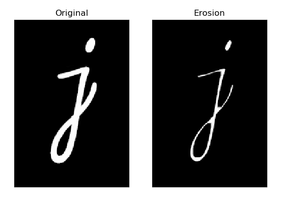
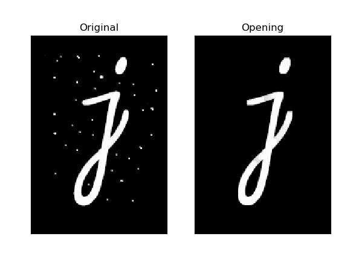
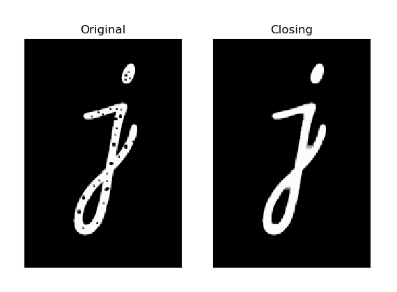
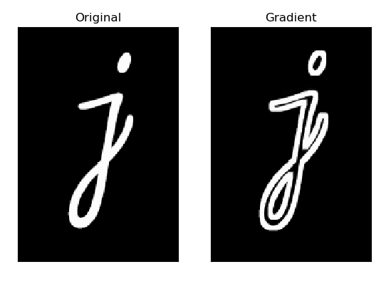
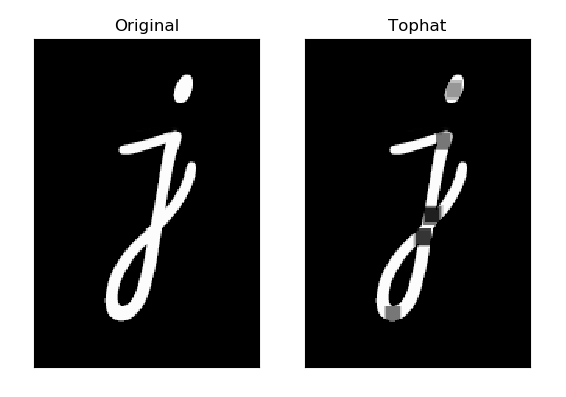
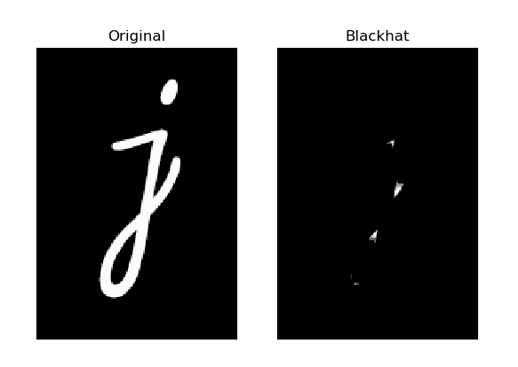

## 4. 形态学转换

*目标：*
* 学习不同的形态学操作，例如腐蚀，膨胀，开运算，闭运算等。
* 我们要学习的函数有：cv2.erode()，cv2.dilate()，cv2.morphologyEx()等

### 原理

形态学操作是根据图像形状进行的简单操作。一般情况下对二值化图像进行的操作。需要输入两个参数，一个是原始图像，第二个被称为结构化元素或核，它是用来决定操作的性质的。两个基本的形态学操作是腐蚀和膨胀。他们的变体构成了开运算，闭运算，梯度等。我们会以下图为例逐一介绍它们。


### 4.1 腐蚀

就像土壤侵蚀一样，这个操作会把前景物体的边界腐蚀掉（但是前景仍然是白色）。这是怎么做到的呢？卷积核沿着图像滑动，如果与卷积核对应的原图 像的所有像素值都是1，那么中心元素就保持原来的像素值，否则就变为零。

这会产生什么影响呢？根据卷积核的大小靠近前景的所有像素都会被腐蚀掉（变为 0），所以前景物体会变小，整幅图像的白色区域会减少。这对于去除白噪声很有用，也可以用来断开两个连在一块的物体等。

这里我们有一个例子，使用一个 5x5 的卷积核，其中所有的值都是1。让我们看看他是如何工作的：

```
import cv2 
import numpy as np
from matplotlib import pyplot as plt

img = cv2.imread('j.png',0) 
kernel = np.ones((5,5),np.uint8) 
erosion = cv2.erode(img,kernel,iterations = 1)

img1 = cv2.cvtColor(img, cv2.COLOR_BGR2RGB)
img2 = cv2.cvtColor(erosion, cv2.COLOR_BGR2RGB)

plt.subplot(121),plt.imshow(img1),plt.title('Original') 
plt.xticks([]), plt.yticks([]) 
plt.subplot(122),plt.imshow(img2),plt.title('Erosion') 
plt.xticks([]), plt.yticks([]) 
plt.show()
```

结果：


### 4.2 膨胀 

与腐蚀相反，与卷积核对应的原图像的像素值中只要有一个是 1，中心元素的像素值就是 1。所以这个操作会增加图像中的白色区域（前景）。一般在去噪声时先用腐蚀再用膨胀。因为腐蚀在去掉白噪声的同时，也会使前景对象变小。所以我们再对他进行膨胀。这时噪声已经被去除了，不会再回来了，但是前景还在并会增加。膨胀也可以用来连接两个分开的物体。

```
dilation = cv2.dilate(img,kernel,iterations = 1)
```

结果：


### 4.3 开运算 
 
先进性腐蚀再进行膨胀就就叫做开运算。就像我们上面介绍的那样，它被用来去除噪声。这里我们用到的函数是 cv2.morphologyEx()。

```
opening = cv2.morphologyEx(img, cv2.MORPH_OPEN, kernel)
```

结果：


### 4.4 闭运算

先膨胀再腐蚀。它经常被用来填充前景物体中的小洞，或者前景物体上的 小黑点。

```
closing = cv2.morphologyEx(img, cv2.MORPH_CLOSE, kernel)
```

结果：


### 4.5 形态学梯度 

其实就是一幅图像膨胀与腐蚀的差别。 结果看上去就像前景物体的轮廓。
```
gradient = cv2.morphologyEx(img, cv2.MORPH_GRADIENT, kernel)
```

结果：


### 4.6 礼帽 

原始图像与进行开运算之后得到的图像的差。下面的例子是用一个**9 x 9**的 核进行礼帽操作的结果。
```
tophat = cv2.morphologyEx(img, cv2.MORPH_TOPHAT, kernel)
```

结果：


### 4.7 黑帽 

进行闭运算之后得到的图像与原始图像的差。
```
blackhat = cv2.morphologyEx(img, cv2.MORPH_BLACKHAT, kernel)
```

结果：


### 4.8 形态学操作之间的关系

我们把以上集中形态学操作之间的关系列出来以供大家参考：

```
Opening:
dst = open(src, element) = dilate(erode(src, element), element)
Closing:
dst = close(src, element) = erode(dilate(src, element), element)
Morphological gradient:
dst = morph. _grad( src, element) = dilate(src, element) - erode(src, element)
“Top hat": 
dst = tophat(src, element) = sre - open(src, element)
“Black hat":
dst = blackhat(src, element) = close(src, element) - src 

```

#### 结构化元素 
在前面的例子中我们使用 Numpy 构建了结构化元素，它是正方形的。但有时我们需要构建一个椭圆形/圆形的核。为了实现这种要求，提供了OpenCV 函数 cv2.getStructuringElement()。你只需要告诉他你需要的核的形状和大小。

```
# Rectangular Kernel 
>>> cv2.getStructuringElement(cv2.MORPH_RECT,(5,5)) 
array([[1, 1, 1, 1, 1],
       [1, 1, 1, 1, 1], 
       [1, 1, 1, 1, 1], 
       [1, 1, 1, 1, 1],
        [1, 1, 1, 1, 1]], dtype=uint8)
# Elliptical Kernel 
>>> cv2.getStructuringElement(cv2.MORPH_ELLIPSE,(5,5)) 
array([[0, 0, 1, 0, 0],
       [1, 1, 1, 1, 1],
       [1, 1, 1, 1, 1], 
       [1, 1, 1, 1, 1],
       [0, 0, 1, 0, 0]], dtype=uint8)
# Cross-shaped Kernel 
>>> cv2.getStructuringElement(cv2.MORPH_CROSS,(5,5)) 
array([[0, 0, 1, 0, 0], 
       [0, 0, 1, 0, 0], 
       [1, 1, 1, 1, 1],
       [0, 0, 1, 0, 0], 
       [0, 0, 1, 0, 0]], dtype=uint8)
```

更多资源 
1. [Morphological Operations](http://homepages.inf.ed.ac.uk/rbf/HIPR2/morops.htm) at HIPR2


