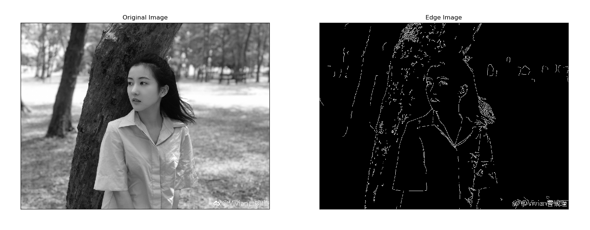

## 5. 图像梯度

* 图像梯度，图像边界等 
* 使用到的函数有：cv2.Sobel()，cv2.Schar()，cv2.Laplacian()等

>**原理:**
梯度简单来说就是求导。 OpenCV 提供了三种不同的梯度滤波器，或者说高通滤波器：Sobel, Scharr 和 Laplacian。我们会意义介绍他们。
Sobel，Scharr 其实就是求一阶或二阶导数。Scharr 是对 Sobel（使用小的卷积核求解求解梯度角度时）的优化。Laplacian 是求二阶导数。

### 5.1 Sobel 算子和 Scharr 算子 

Sobel 算子是高斯平滑与微分操作的结合体，所以它的抗噪声能力很好。你可以设定求导的方向（xorder 或 yorder）。还可以设定使用的卷积核的大小（ksize）。如果 ksize=-1，会使用 3x3 的 Scharr 滤波器，它的的效果要 比 3x3 的 Sobel 滤波器好（而且速度相同，所以在使用 3x3 滤波器时应该 量使用 Scharr 滤波器）。3x3 的 Scharr 滤波器卷积核如下：


### 5.2 Laplacian 算子

拉普拉斯算子可以使用二阶导数的形式定义，可假设其离散实现类似于二 阶 Sobel 导数，事实上，OpenCV 在计算拉普拉斯算子时直接调用 Sobel 算 子。计算公式如下：


拉普拉斯滤波器使用的卷积核： 


#### 代码 
下面的代码分别使用以上三种滤波器对同一幅图进行操作。使用的卷积核 都是 5x5 的。

```
""" 
import cv2 
import numpy as np 
from matplotlib import pyplot as plt
img=cv2.imread('1.png',0)
#cv2.CV_64F输出图像的深度（数据类型），可以使用 -1,与原图像保持一致 np.uint8
laplacian=cv2.Laplacian(img,cv2.CV_64F) 
# 参数 1,0 为只在 x 方向求一阶导数，最大可以求2阶导数。
sobelx=cv2.Sobel(img,cv2.CV_64F,1,0,ksize=5)
# 参数 0,1 为只在 y 方向求一阶导数，最大可以求 2 阶导数。
sobely=cv2.Sobel(img,cv2.CV_64F,0,1,ksize=5)

plt.subplot(2,2,1),plt.imshow(img,cmap = 'gray') 
plt.title('Original'), plt.xticks([]), plt.yticks([])
plt.subplot(2,2,2),plt.imshow(laplacian,cmap = 'gray')
plt.title('Laplacian'), plt.xticks([]), plt.yticks([])
plt.subplot(2,2,3),plt.imshow(sobelx,cmap = 'gray') 
plt.title('Sobel X'), plt.xticks([]), plt.yticks([]) 
plt.subplot(2,2,4),plt.imshow(sobely,cmap = 'gray') 
plt.title('Sobel Y'), plt.xticks([]), plt.yticks([])
plt.show()
```


**一个重要的事!**
 在查看上面这个例子的注释时不知道你有没有注意到：当我们可以通过参 数 -1 来设定输出图像的深度（数据类型）与原图像保持一致，但是我们在代 码中使用的却是 cv2.CV_64F。这是为什么呢？想象一下一个从黑到白的边界 的导数是整数，而一个从白到黑的边界点导数却是负数。如果原图像的深度是 np.int8 时，所有的负值都会被截断变成 0，换句话说就是把把边界丢失掉。 
 所以如果这两种边界你都想检测到，最好的的办法就是将输出的数据类型设置的更高，比如 cv2.CV_16S，cv2.CV_64F 等。取绝对值然后再把它转回到 cv2.CV_8U。下面的示例演示了输出图片的深度不同造成的不同效果。
```
import cv2 
import numpy as np 
from matplotlib import pyplot as plt
img = cv2.imread('3.png',0)
# Output dtype = cv2.CV_8U 
sobelx8u = cv2.Sobel(img,cv2.CV_8U,1,0,ksize=5) 
# 也可以将参数设为 -1 
# sobelx8u = cv2.Sobel(img,-1,1,0,ksize=5)
# Output dtype = cv2.CV_64F. Then take its absolute and convert to cv2.CV_8U 
sobelx64f = cv2.Sobel(img,cv2.CV_64F,1,0,ksize=5) 
abs_sobel64f = np.absolute(sobelx64f) 
sobel_8u = np.uint8(abs_sobel64f)
plt.subplot(1,3,1),plt.imshow(img,cmap = 'gray') 
plt.title('Original'), plt.xticks([]), plt.yticks([]) 
plt.subplot(1,3,2),plt.imshow(sobelx8u,cmap = 'gray') 
plt.title('Sobel CV_8U'), plt.xticks([]), plt.yticks([]) 
plt.subplot(1,3,3),plt.imshow(sobel_8u,cmap = 'gray') 
plt.title('Sobel abs(CV_64F)'), plt.xticks([]), plt.yticks([])
plt.show()
```


## 6. Canny 边缘检测
### 目标 
OpenCV 中的 Canny 边缘检测 
* 了解 Canny 边缘检测的概念 
* 学习函数 cv2.Canny()
---
### 6.1 原理 

Canny 边缘检测是一种非常流行的边缘检测算法，是 John F.Canny 在 1986 年提出的。它是一个有很多步构成的算法，我们接下来会逐步介绍。

#### 6.1.1  噪声去除

由于边缘检测很容易受到噪声影响，所以第一步是使用 5x5 的高斯滤波器 去除噪声，这个前面我们已经学过了。

#### 6.1.2 计算图像梯度

对平滑后的图像使用 Sobel 算子计算水平方向和竖直方向的一阶导数（图像梯度）（Gx 和 Gy）。根据得到的这两幅梯度图（Gx 和 Gy）找到边界的梯度和方向，公式如下： 


梯度的方向一般总是与边界垂直。梯度方向被归为四类：垂直，水平，和 两个对角线。

#### 6.1.3 非极大值抑制 

在获得梯度的方向和大小之后，应该对整幅图像做一个扫描，去除那些非 边界上的点。对每一个像素进行检查，看这个点的梯度是不是周围具有相同梯度方向的点中最大的。如下图所示：


现在你得到的是一个包含“窄边界”的二值图像。

#### 6.1.4 滞后阈值 
现在要确定那些边界才是真正的边界。这时我们需要设置两个阈值： minVal 和 maxVal。当图像的灰度梯度高于 maxVal 时被认为是真的边界，那些低于 minVal 的边界会被抛弃。如果介于两者之间的话，就要看这个点是否与某个被确定为真正的边界点相连，如果是就认为它也是边界点，如果不是就抛弃。如下图：

A 高于阈值 maxVal 所以是真正的边界点，C 虽然低于 maxVal 但高于 minVal 并且与 A 相连，所以也被认为是真正的边界点。而 B 就会被抛弃，因为他不仅低于 maxVal 而且不与真正的边界点相连。所以选择合适的 maxVal 和 minVal 对于能否得到好的结果非常重要。
在这一步一些小的噪声点也会被除去，因为我们假设边界都是一些长的线 段。
### 6.2OpenCV 中的 Canny 边界检测 
在 OpenCV 中只需要一个函数：cv2.Canny()，就可以完成以上几步。 让我们看如何使用这个函数。这个函数的第一个参数是输入图像。第二和第三个分别是 **minVal**和**maxVal**。第三个参数设置用来计算图像梯度的 Sobel 卷积核的大小，默认值为3。最后一个参数是**L2gradient**，它可以用来设定求梯度大小的方程。如果设为**True**，就会使用我们上面提到过的方程，否则使用方程：

代替，默认值为**False**。

```
import cv2 
import numpy as np
from matplotlib import pyplot as plt

img = cv2.imread('5.jpg',0) 
edges = cv2.Canny(img,100,200)

plt.subplot(121),plt.imshow(img,cmap = 'gray') 
plt.title('Original Image'), plt.xticks([]), plt.yticks([]) 
plt.subplot(122),plt.imshow(edges,cmap = 'gray') 
plt.title('Edge Image'), plt.xticks([]), plt.yticks([])
plt.show()
```

