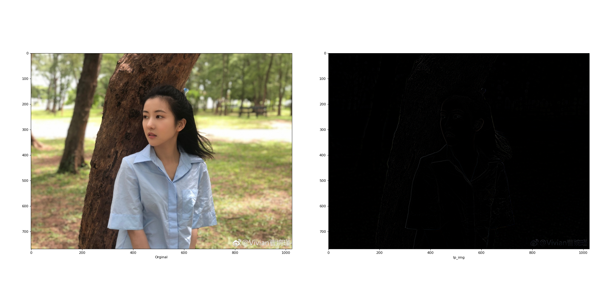
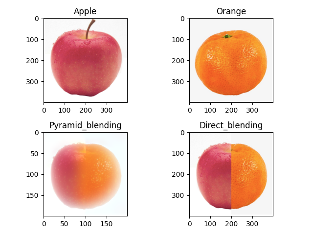

##  7. 图像金字塔

**目标**
* 学习图像金字塔
* 使用图像创建一个新水果:“橘子苹果”
* 将要学习的函数有:  `cv2.pyrUp(),cv2.pyrDown()`。
---

### 7.1 原理
一般情况下,我们要处理是一副具有固定分辨率的图像。但是有些情况下,我们需要对同一图像的不同分辨率的子图像进行处理。比如,我们要在一幅图像中查找某个目标,比如脸,我们不知道目标在图像中的尺寸大小。这种情况下,我们需要创建创建一组图像,这些图像是具有不同分辨率的原始图像。我们把这组图像叫做图像金字塔(简单来说就是同一图像的不同分辨率的子图集合)。如果我们把最大的图像放在底部,最小的放在顶部,看起来像一座金字塔,故而得名图像金字塔。

有两类图像金字塔:高斯金字塔和拉普拉斯金字塔。

高斯金字塔的顶部是通过将底部图像中的连续的行和列去除得到的。顶部图像中的每个像素值等于下一层图像中 5 个像素的高斯加权平均值。这样操作一次一个 MxN 的图像就变成了一个 M/2xN/2 的图像。所以这幅图像的面积就变为原来图像面积的四分之一。这被称为 Octave。连续进行这样的操作我们就会得到一个分辨率不断下降的图像金字塔。我们可以使用函数cv2.pyrDown() 和 cv2.pyrUp() 构建图像金字塔。

函数 cv2.pyrDown() 从一个高分辨率大尺寸的图像向上构建一个金子塔(尺寸变小,分辨率降低)。cv2.pyrDown()函数接受3个参数：

>* tmp: 当前图像，初始化为原图像 src 。
>* dst: 目的图像( 显示图像，为输入图像的一半)
>* Size( tmp.cols/2, tmp.rows/2 ) :目的图像大小， 既然我们是向下采样默认情况下直接输入需要操作的图像就可以，他会把图像按缩小1/4的来处理。

```
img = cv2.imread('1.jpg')
lower_reso = cv2.pyrDown(higher_reso)
```

从坐标轴看大小，图像缩小了一倍。像素上可以看出变得更模糊。以下为结果：


函数 cv2.pyrUp() 从一个低分辨率小尺寸的图像向下构建一个金子塔(尺
寸变大,但分辨率不会增加)。

```
higher_reso2 = cv2.pyrUp(lower_reso)
```

你要记住的是是 higher_reso2 和 higher_reso 是不同的。因为一旦使用 cv2.pyrDown(),图像的分辨率就会降低,信息就会被丢失。下图就是从 cv2.pyrDown() 产生的图像金字塔的(由下到上)第三层图像使用函数cv2.pyrUp() 得到的图像,与原图像相比分辨率差了很多。


拉普拉斯金字塔可以有高斯金字塔计算得来,公式如下:


拉普拉金字塔的图像看起来就像边界图,其中很多像素都是 0。他们经常被用在图像压缩中。下图就是一个三层的拉普拉斯金字塔:


### 7.2 使用金字塔进行图像融合

图像金字塔的一个应用是图像融合。例如,在图像缝合中,你需要将两幅图叠在一起,但是由于连接区域图像像素的不连续性,整幅图的效果看起来会很差。这时图像金字塔就可以排上用场了,他可以帮你实现无缝连接。这里的一个经典案例就是将两个水果融合成一个:

```
#!/usr/bin/env python2
# -*- coding: utf-8 -*-
"""
Created on Fri Apr 17 12:15:34 2020

@author: doublewaters
"""

import cv2
import numpy as np,sys
from matplotlib import pyplot as plt

A = cv2.imread('apple.png')
B = cv2.imread('orange.png')

A = cv2.cvtColor(A, cv2.COLOR_BGR2RGB)
B = cv2.cvtColor(B, cv2.COLOR_BGR2RGB)

# generate Gaussian pyramid for A
G = A.copy()
print(G)
gpA = [G]
for i in range(6):
    G = cv2.pyrDown(G)
    gpA.append(G)
G = B.copy()
gpB = [G]
for i in range(6):
    G = cv2.pyrDown(G)
    gpB.append(G)
lpA = [gpA[5]]
for i in range(6,0,-1):
    print(i)
    GE = cv2.pyrUp(gpA[i])
    GE=cv2.resize(GE,gpA[i - 1].shape[-2::-1])
    L = cv2.subtract(gpA[i-1],GE)
    print(L.shape)
    lpA.append(L)
# generate Laplacian Pyramid for B
lpB = [gpB[5]]
for i in range(6,0,-1):
    print(i)
    GE = cv2.pyrUp(gpB[i])
    GE = cv2.resize(GE, gpB[i - 1].shape[-2::-1])
    L = cv2.subtract(gpB[i-1],GE)
    print(L.shape)
    lpB.append(L)
# Now add left and right halves of images in each level
LS = []
lpAc=[]
for i in range(len(lpA)):
    b=cv2.resize(lpA[i],lpB[i].shape[-2::-1])
    print(b.shape)
    lpAc.append(b)
print(len(lpAc))
print(len(lpB))
j=0
for i in zip(lpAc,lpB):
    print(i)
    print('ss')
    la,lb=i
    print(la)
    print(lb)
    rows,cols,dpt = la.shape
    ls = np.hstack((la[:,0:cols//2], lb[:,cols//2:]))
    j=j+1
    print(j)
    LS.append(ls)
ls_ = LS[0]
for i in range(1,6):
    ls_ = cv2.pyrUp(ls_)
    ls_= cv2.resize(ls_, LS[i].shape[-2::-1])
    ls_ = cv2.add(ls_, LS[i])
# image with direct connecting each half
B= cv2.resize(B, A.shape[-2::-1])
real = np.hstack((A[:,:cols//2],B[:,cols//2:]))
# cv2.imwrite('Pyramid_blending2.jpg',ls_)
# cv2.imwrite('Direct_blending.jpg',real)

plt.subplot(221),plt.imshow(A),plt.title("Apple")
plt.subplot(222),plt.imshow(B),plt.title("Orange")
plt.subplot(223),plt.imshow(ls_),plt.title("Pyramid_blending")
plt.subplot(224),plt.imshow(real),plt.title("Direct_blending")
plt.show()
```



实现上述效果的步骤如下:
1. 读入两幅图像,苹果和句子
2. 构建苹果和橘子的高斯金字塔(6 层)
3. 根据高斯金字塔计算拉普拉斯金字塔
4. 在拉普拉斯的每一层进行图像融合(苹果的左边与橘子的右边融合)
5. 根据融合后的图像金字塔重建原始图像

下图展示了金子塔的构建,以及如何从金字塔重建原始图像的过程。
