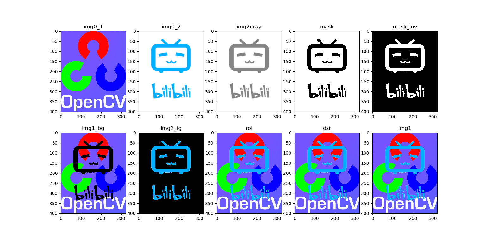

# 图像上的算术运算
### _目标:_
* 学习图像上的算术运算，加法，减法，位运算等。 
* 我们将要学习的函数与有：cv2.add()，cv2.addWeighted() 等。

## 1 图像加法 
你可以使用函数 cv2.add() 将两幅图像进行加法运算，当然也可以直接使 用 numpy，res=img1+img。两幅图像的大小，类型必须一致，或者第二个 图像可以使一个简单的标量值。

>注意: OpenCV 中的加法与Numpy的加法是有所不同的。OpenCV 的加法是一种饱和操作，而Numpy的加法是一种模操作。

```
x = np.uint8([250])
y = np.uint8([10])
print(cv2.add(x,y)) # 250+10 = 260 => 255 
                    # >>>[[255]]
print(x+y)          # 250+10 = 260 % 256 = 4 
                    # >>>[4]
```     
这种差别在你对两幅图像进行加法时会更加明显。OpenCV 的结果会更好 一点。所以我们尽量使用 OpenCV 中的函数。

## 2 图像混合 
这其实也是加法，但是不同的是两幅图像的权重不同，这就会给人一种混 合或者透明的感觉。图像混合的计算公式如下：
$$g(x)=(1-\alpha) f_{0}(x)+\alpha f_{1}(x)$$
通过修改 α 的值（0 → 1），可以实现非常酷的混合。
现在我们把两幅图混合在一起。第一幅图的权重是 0.7，第二幅图的权重 是 0.3。函数 cv2.addWeighted() 可以按下面的公式对图片进行混合操作。
$$d s t=\alpha \cdot i m g 1+\beta \cdot i m g 2+\gamma$$
这里 γ 的取值为 0。
```
import cv2 
import numpy as np

img1=cv2.imread('ml.png') 
img2=cv2.imread('opencv_logo.jpg')

dst=cv2.addWeighted(img1,0.7,img2,0.3,0)
cv2.imshow('dst',dst) 
cv2.waitKey(0) 
cv2.destroyAllWindow()
```
下面就是结果：

 

## 3 按位运算 
这里包括的按位操作有：AND，OR，NOT，XOR 等。当我们提取图像的一部分，选择非矩形 ROI 时这些操作会很有用（下一章你就会明白）。下面的例子就是教给我们如何改变一幅图的特定区域。 我想把OpenCV的标志放到另一幅图像上。如果我使用加法，颜色会改变，如果使用混合，会得到透明效果，但是我不想要透明。如果他是矩形我可以象上一章那样使用ROI。但是他不是矩形。但是我们可以通过下面的按位运算实现：
```
import cv2 
import numpy as np
#加载图像 
img1 = cv2.imread('opencv.png')
img2 = cv2.imread('1.png') 
# I want to put logo on top-left corner, So I create a ROI 
rows,cols,channels = img2.shape 
roi = img1[0:rows, 0:cols ]
# Now create a mask of logo and create its inverse mask also 
img2gray = cv2.cvtColor(img2,cv2.COLOR_BGR2GRAY) 
ret,mask = cv2.threshold(img2gray, 175, 255, cv2.THRESH_BINARY) 
mask_inv = cv2.bitwise_not(mask)
# Now black-out the area of logo in ROI 
#取roi中与mask 中不为零的值对应的像素的值，其他值为0
#注意这里必须有mask=mask或者mask=mask_inv,其中的mask=不能忽略
img1_bg = cv2.bitwise_and(roi,roi,mask = mask) 
#取roi中与mask_inv中不为零的值对应的像素的值，其他值为0。
# Take only region of logo from logo image.
img2_fg = cv2.bitwise_and(img2,img2,mask = mask_inv)
# Put logo in ROI and modify the main image 
dst = cv2.add(img1_bg,img2_fg) 
img1[0:rows, 0:cols ] = dst
cv2.imshow('res',img1) 
cv2.imwrite('13_3.png',img1)
cv2.waitKey(0) 
cv2.destroyAllWindows()
```
结果如下:
 